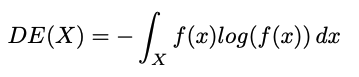

#### Resources 

Paper about GNNs for EEG data: https://arxiv.org/abs/2310.02152
syllabus: [M-PML], chapter 23.-23.2, 23.4
Blog posts:
https://distill.pub/2021/gnn-intro/
https://distill.pub/2021/understanding-gnns/

SOTA challenges:
https://ieeexplore.ieee.org/document/9339909
General GNN paper:
https://arxiv.org/abs/2104.13478
Spectral GNN paper:
https://arxiv.org/abs/2302.05631

Code ressources:
EEG preprocessing library with pytorch: https://github.com/torcheeg/torcheeg
GNN ex01 from lecture: https://colab.research.google.com/drive/1gBJgqfw1OXJ1qAT_IbToaZDtGRy6gGzP

data:
https://torcheeg.readthedocs.io/en/latest/generated/torcheeg.datasets.SEEDDataset.html#torcheeg.datasets.SEEDDataset

### Notes for blog post https://distill.pub/2021/gnn-intro/

A neural network designed to leverage the structure of graphs.

Vertex nodes
Edges
Master node (global information about graph, number of node, longest path)

Graphs are useful for representing structures that might have variable sizes, where things are not fully connected or where connectivity might vary for each node. 

Graph level task: Predict something about the graph
Node level task: Predict an attribute about a node, it's identity or role in the graph. Analagous to a segmentation task. 
Edge level task: Predict the existence of an edge or property of an edge. What is the role of the edge in a graph or should edge be there? Input fully connected graph and output relevant edges and/or their roles

How do we represent graphs for DL tasks:
We can choose to include four types of information: Vertex information, edge information, global information and connectivity. 
It is not easy to encode connectivity because several different permutations of adjacency matrices can encode for the same connectivity. Also adjacency matrices will often be sparse.

A better way is to use adjacency list. 
Whilst attributes of nodes/edges/global can be represented as scalars, they are usually encoded as vectors. They are usually represented for the whole graph: [𝑛𝑛𝑜𝑑𝑒𝑠,𝑛𝑜𝑑𝑒𝑑𝑖𝑚]

GNN defintion:
A GNN is an optimizable transformation on all attributes of the graph (nodes, edges, global-context) that preserves graph symmetries (permutation invariances)
GNNs take a graph as input and output a graph as well. They transform the embeddings on the node, edge and global level without altering the connectivity of the graph. 

##### Simple GNN
Simple GNN: Has an MLP or another model on each component of the graph; a GNN Layer. For each node vector we apply the model and get back a learned node vector. We do the same for each edge and also for the global context vector. 
The subsequent graph is now a new layer of the model. We can stack layers on top of each other. 
Since the connectivity is unchanged the dimension of input and output matches. 

GNN Pooling:
If we want to predict something about the nodes, but we do not have node information we can use pooling. If we have node information but we do not have edge information we can use pooling. 
procedure:
- For each item we want to pool (what is relevant for the node or edge) gather each of their embeddings and concat into a matrix
- Aggregate embeddings, usually via sum operation
Pooling for global prediction: Gather all avaialable node or edge information together and aggregate.

We want to produce a graph and then pass aggregated graph information into a classification layer that can output a prediction. 

##### Mode advanced GNNs
To make more sophisticated GNNs we can utilize the connectivity of the graph. Within the GNN layer we can pass information from neighbouring nodes or edges using message passing. 
This will influence the embeddings of the nodes or edges. 

Message passing steps: 
- for each node, gather all neighbouring node embeddings
- Aggregate neighbouring node embeddings with for example SUM
- The pooled messages are passes through and update function, usually a learned neural network.

Message passing can be applied to either nodes or edges. Message passing is reminiscient of a standard convolution however allows for variable neighbourhood size. 
We can stack message passing layers on top of eachother such that a node can receive information links away from it. If we stack three layers, a node will get information from it's neighbour, the neighbour's neighbour and the neighbour's neighbour's neighbour. 
What we are learning is the MLP weights that transform the embeddings at eah step. That is the objective. 
Which graph attributes to update and in which order we update is a design decision whe constructing GNNs: Open research area. 

An issue with message passing is that far aaway nodes will never share information. We could use multiple Graph net layers but this becomes computationally expensive. 
We can use the global representation of the graph to pass information far away. The global representation is connected to each node/edge. 
We can concatenate the node information, adjacent nodes, adjacent edges and the global embedding and then aggregate across the concatenation. Our new graph representation will thus contain all the information of the graph. 

### Notes for Paper about GNNs for EEG data: https://arxiv.org/abs/2310.02152

GNNs are increasingly being used for EEG classification tasks: Among those neurological disease and disorder prediction. 
THere is a prevalance of spectral over spatial GNN methods. 
Standard forms of node features: Most popular being raw EEG signal and differential entropy. 

We want to get away from manual feature extraction:  Automated feature extraction methods are needed to overcome these limitations, improve efficiency, reduce bias, and enhance classifier adaptability to different EEG datasets.
CNNs and LSTM networks struggle to capture the dynamics of EEG signals and the temporal dependencies. 
GNNs can capture the complex interactions amongst electrodes. 

General GNN architechture for EEG graph classification, courtesy of Graph Neural Network-based EEG Classification: A Survey: 

####Distinction between spatial and spectral GNNs:
Spatial GNNs take information from neighbouring nodes much like traditional convolution. Stacking layers implies getting information from further away. 
Spectral GNNS perform information aggregation in the graph frequency domain; low and high frequency components capture local and global information respectively. 
Spectral GNNs are naturally connected to graph signal processing; however do not generalize well to large graphs as they depend on eigendecomposition of graph Laplacian. Spatial GNNs can applied on large graphs as they mostly 
message pass locally, but may also have issues with over smoothin; all node embeddings becoming similar. Makes sense. 

Spectral GNNs leverages spectral domain analysis of graph-structured data. Guess we have to figure out what that means lol. The eeg graph is transformed into the spectral domain using Graph Fourier Transform (GFT) and Graph Signal Processing. Need to do some linalg refresher, Laplacian eigendecomposition. The operations are computationally expensive, but Chebyshev GNN (ChebConv) is a useful approximation. Spectral GNNs rely on fixed number of nodes. This should be fine for our use case, as the number of electrodes is stable. 

#### Brain graph structure
The brain graph structure based on the eeg data can be manually defined or learned. Generally there are SC and FC approaches:
SC:
Typical connectivity is defined by a measure of distance of electrodes from one another. A threshold is used to cut off connections too far away. 
This is invariant to the signal itself and thereby also noise of the signal. One issue is that the graph is limited to local structures. 
We may insert global edges to combat this. 
FC: 
Determines connectivity of nodes by measuring degree of interaction. 
May be learned 

Choosing a brain graph representation depends o nthe task and data at hand. Each representation has its advantages and disadvantages. 

#### Node feature representations
Most common for time-domains is differential entropy and the raw signal as node features. 
Differential entropy describes the complexity of a continuos variable:

However many papers also defined node feature as the raw EEG signal. A limitation of this is that the signal may be too long to effectively process for the GNN. 
Some preprocessing may therefore be done or we could use summary statistics such as the mean, median and standard deviation. 

Frequency representations usually rely on Fourier Transform and are often quite low-dimensional making them easier to process.

Graph theoretical features, like betweenness centrality can also be used. A limitation is that the brain graph needs to be known. 

After choosing a node feature representation we may want to preprocess it by applying a CNN or MLP to reduce dimensionality and noise. 

#### Types of Graph Convolutional Layers (GCN)
ChebConv often utilized; although given the small size of the graphs it seems unwarranted. 
Other than that, I am confused. 

#### Node pooling for pruning graph
Does not see much use in EEG. Might aid explainability but seems unnecessary given the small amount of nodes. 

#### Node embeddings -> graph embeddings 😎😎😎
Simplest approach is to concatenate all the node features. 
However this makes it less generalizeable as we need the same number of nodes. 
Also a lot of information may be redundant as it is represented in several of the node embeddings. 

A readout function addresses many of the issues that come with concatenating node features. 
The readout function can be any permutation invariant function applied over all the node embeddings. Common examples include sum, average and maximum. 
Alternatively one could apply CNN style averaging or maximum pooling, node wise. That seems smart? 

#### Discussion

Many papers use the ChebConv or vanilla spatial GCN. There is no particular reason for this, it might just be because the EEG-GNN area is quite new. 
Many papers struglle with generalizability because they use ChebConv or because they concatenate node embeddings for graph prediction. 
This also means there is a lack of transfer learning which could be interesting to explore. Use of frequency band information could be used better as well.
Integrate neuroscientific ideas into EEG-GNN modelling. 

Nice paper. 

